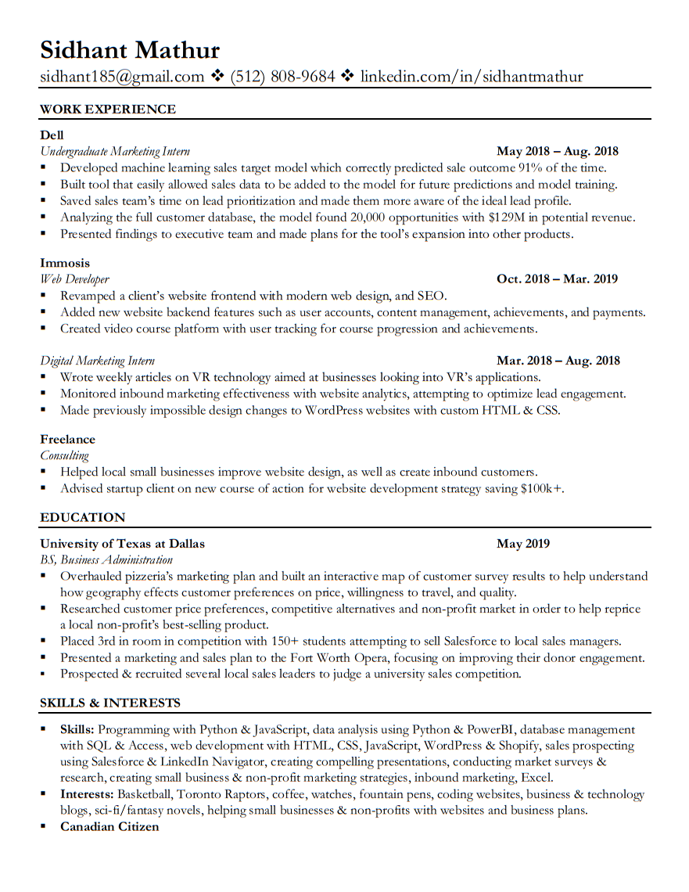
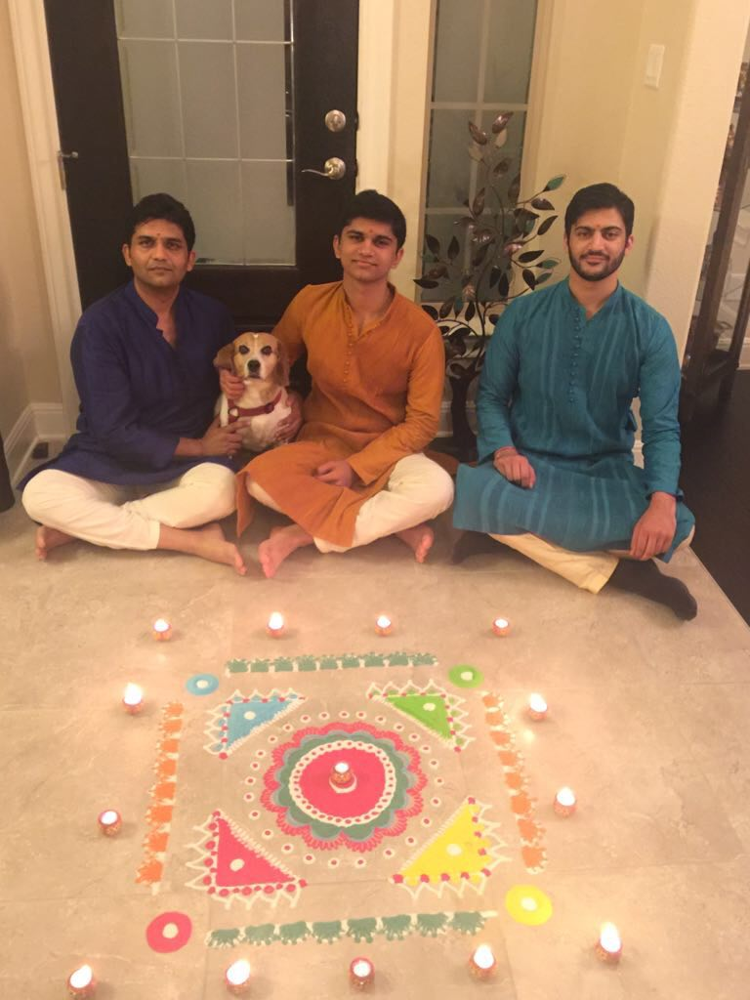
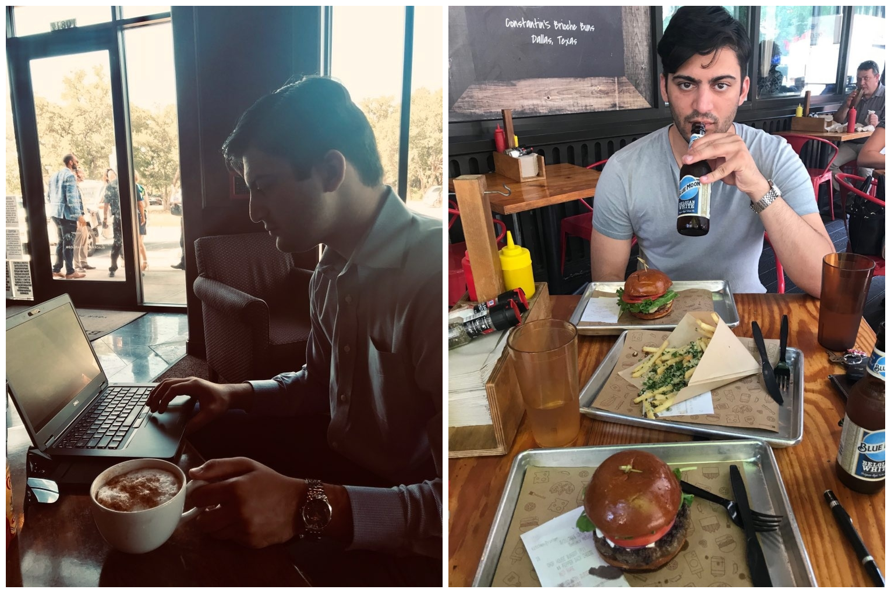

Hello, my name is Sidhant. I am an Entreprenuership Student at the University of Texas at Dallas with a passion for programming, data science and entrepreneurship. Here's a link to my resume: 

I was born in New Delhi, India, but my parents moved to Toronto, Canada when I was three-years-old. I lived in Toronto for thirteen years before moving to Austin, Texas. I went to Vandegrift Highschool for three years in Austin before coming here to UT Dallas for my undergraduate degree in business administation. 

My family has been through many moves and struggles, but we have remained strong throughout, and always moved forward progressing in terms of personal and professional development. We don't mind taking big risks and going through difficult times in order to improve ourselves, and that is a big reason for our success. 

During the summer of 2018 I interned at Dell in the commercial "center of competence" which is a department which evaluates marketing, sales and product while creating strategy for the future. My project centered around targeting customers for a certain product. This was a big step in my professional development as it showed me a whole world of real world events and problems that you don't encounter in the classroom. In a classroom you always have all the data to make the "right" choice. In the real world may have so much data that is mostly noise, and you may have no data at all. You may never even find out if you ultimately made the correct choice in a given situation. The adjustment from the things that make you successful in school to the things that make you successful at work is another hurdle that I managed to overcome, but has made me a much more productive working professional. I am taking up a position with Dell once I graduate from UT Dallas. 

In my free time I have a multitude of hobbies and interests. I am an avid self-taught programmer, and I've worked on personal projects, as well as for clients here in Dallas. I enjoy reading books about business, but sci-fi and fantasy are a lot more fun. I also play basketball a few times a week to keep my skills sharp and continue learning. Learning new skills is one of the things I enjoy the most, and if it's not something that will help me professionally, at least it'll help me on the court. 

