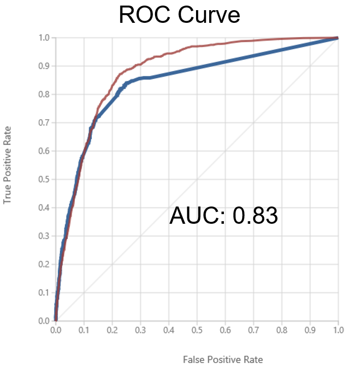
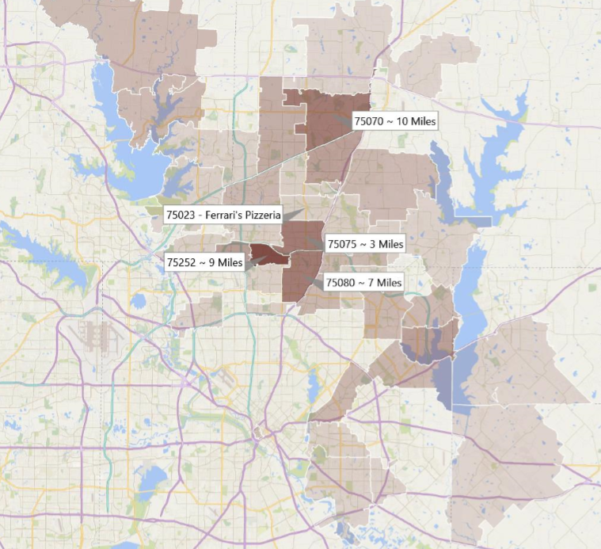
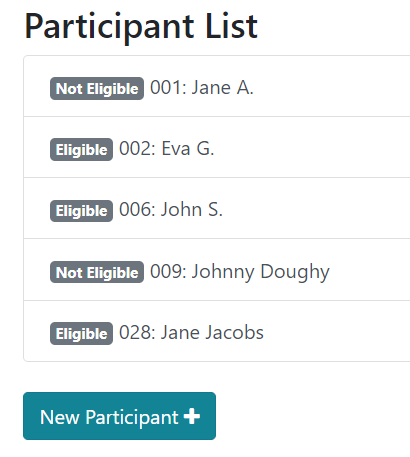

# Business Projects

College coursework and my internship project at Dell. 

### Machine Learning Customer Targeting Tool (Dell)

Microsoft Azure hosted ML tool that receives a customer-list database, runs it through a model, and outputs the likelihood that a customer will buy a certain product. The model's predictions were ~90% accurate and identified an estimated $130 Million in untapped potential customers for the designated product. All details from this project cannot be shared. 

### Marketing Plan (Data Analysis & Visualization)

Marketing plan for local pizzeria. I focused on data analysis, and built an interactive map (cannot be viewed online) that shows the results of survey data by geography, and relates that to the location of the restaurant. 

[Presentation w/ Map](images/marketingpresentation.pdf)
[Paper w/ Data Analysis](images/marketingplan.pdf)

# Programming Projects

See all my code on [Github](https://github.com/sidhantmathur?tab=repositories) and view some smaller projects on my [old portfolio](https://sidhantmathur.github.io/bootstrapportfolio/).

### [Research Manager](https://research-participant-tracker.firebaseapp.com/#/)

Research Participant manager built with Vue.js, Bootstrap and Firestore. Hosted with Firebase. Feel free to add a participant. 

### [Javascript Platformer](https://sidhantmathur.github.io/Platforming-Game/)

Simple platforming game made with Javascript. Use arrowkeys to move and collect all the coins. 

### [Payment Applet](https://rocky-caverns-94159.herokuapp.com/)

Functioning payment page using Stripe and hosted on Heroku. Payments will not go through, so feel free to try it. 

### [Value Proposition Creator](https://sidhantmathur.github.io/valueprop-creator/)

Value proposition creator made with Vue. Uses [these SVGs](https://github.com/sidhantmathur/ValueProp-SVGs) I made for it. 

### [Political Survey](https://sidhantmathur.github.io/Political-Values-Survey/)

Long-term WIP quiz that will determine your fundamental political values, as well as an idealogical category. 

### [Peruzer](https://sidhantmathur.github.io/Peruzer/)

Fictional start-up website with a randomized clickable button. 

### [Javascript Quiz](https://sidhantmathur.github.io/JS-Quiz/)

Quiz applet made in Javascript. Can be adapted to other question banks for classifying quiz takers in catagories. 

### [Array Functions](https://sidhantmathur.github.io/Array-Functions/)

Simple applet that finds unions, intersections and differences between two input sets. 
